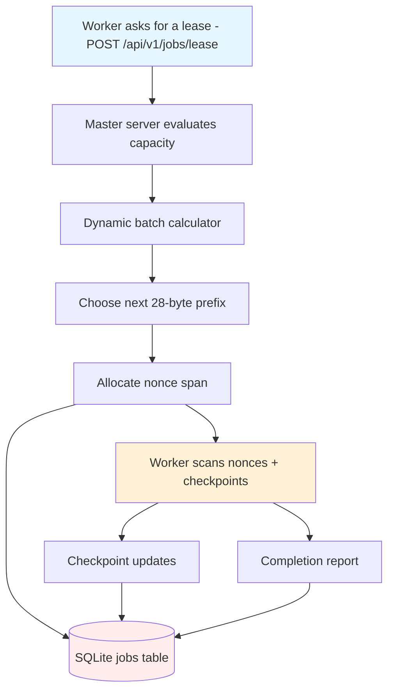
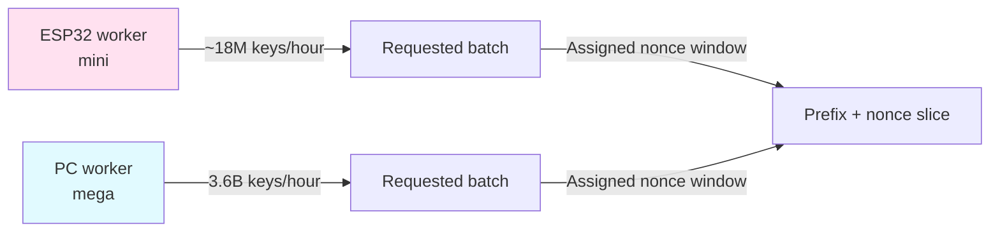
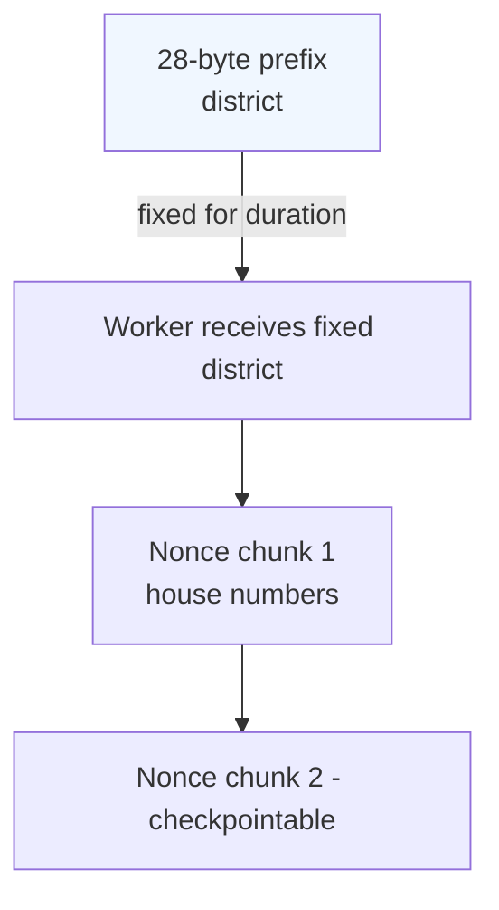

# Brute Force Atlas: Mapping the Distributed Hunt

A creative companion to the system design notes, this playbook explains how the EthScanner distributed force-brute machine is wired: the prefixes that section the search space, the batch crates that workers haul across the nonce ocean, and the choreography that keeps every worker in sync.

## 1. A labyrinth of $2^{256}$ doors

Think of the entire Ethereum private-key universe as a monumental library with $2^{256}$ doors. Every door hides a unique private key, and each key unlocks a single Ethereum address. The master server acts like the librarian with the only surviving copy of the catalog: it never visits every door itself, but it hands out corridors to the workers.

### The master is the head librarian
- The **master server** tracks which corridors (jobs) are pending, which ones are being traversed, and which were completed.
- Each **PC or ESP32 worker** is an intrepid reader who requests a corridor, explores the rooms (nonces), and reports back when the corridor is exhausted or the lease expires.
- The **database** is a ledger of rooms already visited, allowing the librarian to reassign expired corridors without overlap.

## 2. The force-brute voyage (mermaid flow)



This diagram shows the real-time guardrails:

1. Workers request leases with the throughput they just measured.
2. The master chooses a prefix slice and hands out a matching nonce range.
3. Workers scan, checkpoint, and finally announce completion. Expired leases simply return the nonce range to the master for reuse.

## 3. Batches as cargo trains

Every worker does not try to sweep the entire $2^{32}$ nonce span for a prefix in one go; instead, it requests a cargo train (a batch) tailored to its horsepower.

- **ESP32** batches: Imagine a compact freight wagon, optimized for fuel efficiency. A single ESP32 pulls about 18 million keys per hour (so roughly $1.8 \times 10^{7}$ checks). That is a small but lean load that keeps the little embedded miner moving steadily without overheating.
- **PC worker** batches: Think of a high-speed cargo express. Each PC core can push close to $10^{6}$ keys/sec, so a 16-core rig may request a batch of $3.6 \times 10^{9}$ keys — a gigantic crate worth about 84% of a nonce span.



Analogy: a batch is a dedicated train car. The master (rail yard) assigns each train the next available track (nonce range) adjacent to the same station (prefix). If a train breaks down (lease expires), the car is flagged and another crew can continue from the last checkpoint.

## 4. Prefixes as city districts

The prefix is a **fixed 28-byte district** — once the master picks it, every worker scanning that job explores only the four-byte neighborhoods inside it.

```
+-----------------------------+-------------------------+
| 28-byte global prefix (224b) | 4-byte nonce (32b)     |
+-----------------------------+-------------------------+
| Master picks this district once per job                        |
| Workers keep incrementing the nonce like house numbers within that district |
+-----------------------------+-------------------------+
```

Merely iterating the nonce is like walking house-to-house within a district. The prefix tells workers which district they live in; the nonce tells them which house number to knock on.



Since the prefix carries 224 bits, there are $2^{224}$ such districts — each one holds $2^{32}$ houses. Even if every resident had a worker, the whole city would still be a dream for brute force.

## 5. Creative analogies wrap-up

- **Brute force as a library crawl:** Each job is a corridor; each nonce is a book. Workers read for a while, bookmark their spot (checkpoint), and either finish or return the book to the shelf (job expires). The librarian (master) never forgets which book is still available.
- **Batch size as freight car weight:** A worker requests a cargo car sized to match its horsepower. Lightweight ESP32 cars keep the convoy nimble, while PC superloads stretch across the entire track.
- **Prefix as city grid:** The prefix defines the district, the nonce the block and house number.

With these metaphors and diagrams, the distributed brute-force machine stops being an abstract math problem and starts to feel like a train yard, library, and city map — each reinforcing why every worker, batch, and prefix must be orchestrated precisely.
