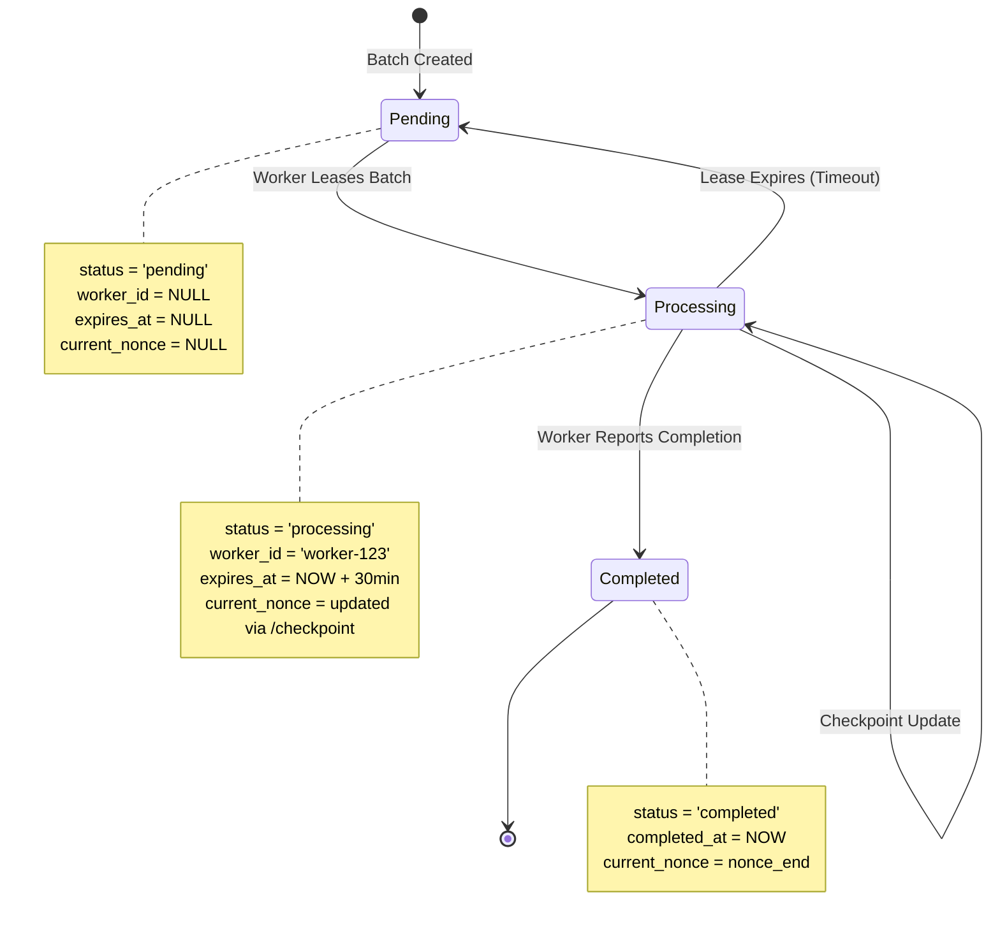
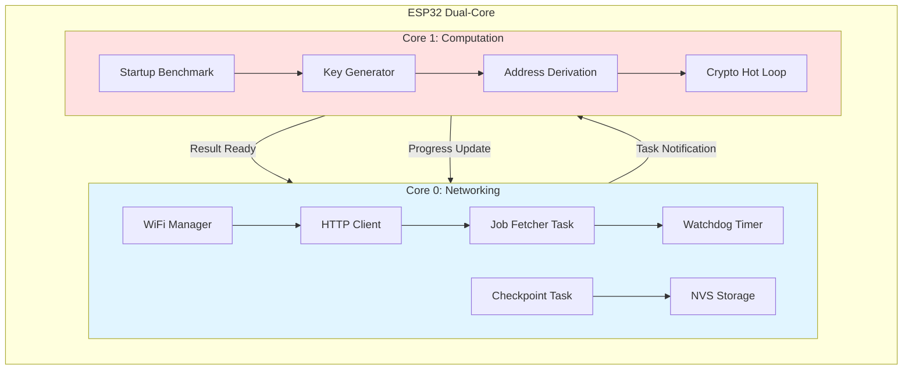
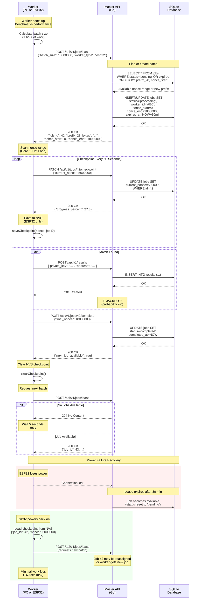

# EthScanner Distributed - System Design Document

**Version:** 1.0  
**Date:** February 14, 2026  
**Status:** Approved

---

## Executive Summary

**EthScanner Distributed** is a distributed computing system designed for educational and research purposes to demonstrate the computational infeasibility of brute-forcing Ethereum private keys. The system employs a master-worker architecture where a central API server coordinates work distribution across heterogeneous computing resources, including PC workers (Go) and embedded ESP32 workers (C++/FreeRTOS).

The project implements a pull-based lease system where workers request job ranges (key prefixes) from the master server, iterate through the search space, and report results. The architecture prioritizes efficiency, scalability, and fault tolerance while adhering to strict constraints: pure Go implementation (no CGO), minimal memory allocations, and optimal CPU utilization.

**Key Objectives:**
- Demonstrate distributed computing principles at scale
- Showcase cryptographic operations on resource-constrained devices (ESP32)
- Educate on the security of Ethereum's 256-bit key space
- Implement a robust, fault-tolerant job distribution system

**Educational Purpose:** This project is strictly for research and educational purposes to illustrate why brute-forcing Ethereum keys is computationally infeasible (2^256 key space ≈ 10^77 possibilities).

---

## Architecture Overview

### High-Level System Architecture

```mermaid
graph TB
    subgraph Master["Master Server (Go)"]
        API[API Server<br/>net/http or chi]
        DB[(SQLite Database<br/>modernc.org/sqlite)]
        JobMgr[Job Manager<br/>Dynamic Batch Allocator]
        API --> JobMgr
        JobMgr --> DB
    end
    
    subgraph PCWorkers["PC Workers (Go)"]
        PCW1[Worker 1<br/>16-core CPU<br/>~3.6B keys/hour]
        PCW2[Worker 2<br/>8-core CPU<br/>~1.8B keys/hour]
        PCW3[Worker N<br/>Multi-core CPU]
    end
    
    subgraph ESPWorkers["ESP32 Workers (C++/FreeRTOS)"]
        ESP1[ESP32-1<br/>Dual Core 240MHz<br/>~18M keys/hour]
        ESP2[ESP32-2<br/>Dual Core 240MHz<br/>~18M keys/hour]
        ESP3[ESP32-N<br/>Dual Core]
    end
    
    PCW1 -->|1. Lease Batch<br/>POST /lease<br/>batch_size=3.6B| API
    PCW2 -->|1. Lease Batch<br/>POST /lease<br/>batch_size=1.8B| API
    PCW3 -->|1. Lease Batch<br/>POST /lease| API
    
    ESP1 -->|1. Lease Batch<br/>POST /lease<br/>batch_size=18M| API
    ESP2 -->|1. Lease Batch<br/>POST /lease<br/>batch_size=18M| API
    ESP3 -->|1. Lease Batch<br/>POST /lease| API
    
    API -->|2. Nonce Range<br/>prefix_28 + nonce_start:end| PCW1
    API -->|2. Nonce Range<br/>prefix_28 + nonce_start:end| PCW2
    API -->|2. Nonce Range<br/>prefix_28 + nonce_start:end| ESP1
    
    PCW1 -.->|3a. Checkpoint (every 5min)<br/>PATCH /checkpoint| API
    ESP1 -.->|3a. Checkpoint (every 60sec)<br/>PATCH /checkpoint| API
    
    PCW1 -->|3b. Complete Batch<br/>POST /complete| API
    ESP1 -->|3b. Complete Batch<br/>POST /complete| API
    
    PCW1 -->|4. Submit Result (if found)<br/>POST /results| API
    ESP1 -->|4. Submit Result (if found)<br/>POST /results| API
    
    style Master fill:#e1f5ff
    style PCWorkers fill:#fff4e1
    style ESPWorkers fill:#ffe1f5
```

### Architecture Principles

1. **Pull-Based Lease System:** Workers actively request jobs, preventing the master from tracking worker availability
2. **Stateless API:** Each request is independent; state is managed in SQLite
3. **Fault Tolerance:** Jobs have expiration times; expired jobs automatically return to the pool
4. **Horizontal Scalability:** Add workers without master reconfiguration
5. **Heterogeneous Computing:** PC and ESP32 workers coexist seamlessly

---

## Key Space Partitioning Logic

### Ethereum Private Key Structure

An Ethereum private key is a **256-bit** (32-byte) number. The search space is astronomically large: **2^256 ≈ 1.16 × 10^77 possibilities**.

#### Dynamic Batching Strategy

The system implements a **dynamic batching** approach where workers request batch sizes based on their computational capacity. This ensures efficient work distribution across heterogeneous hardware (PC vs. ESP32).

**Key Components:**

- **Global Prefix (Master Controlled):** 28 bytes (224 bits) assigned by the API
- **Local Nonce (Worker Search Space):** 4 bytes (32 bits = 4,294,967,296 possibilities) iterated by the worker
- **Batch Size:** Workers request a subset of the 4-byte nonce range based on their capability

#### Architecture: 28-byte Prefix + 4-byte Nonce

```
┌─────────────────────────────────────────────────────────────────┐
│                 256-bit Ethereum Private Key                     │
└─────────────────────────────────────────────────────────────────┘
  ├──────────────────────────────────────────────┬──────────────┤
  │         Global Prefix (224 bits)             │Nonce (32 bits)│
  │           Master Assigns                     │Worker Iterates│
  ├──────────────────────────────────────────────┼──────────────┤
  │              28 bytes                        │   4 bytes    │
  │  0x0102030405...1A1B1C (fixed per job)       │ 0x00000000   │
  │                                              │     to       │
  │                                              │ 0xFFFFFFFF   │
  └──────────────────────────────────────────────┴──────────────┘
```

#### Visual Packet Representation

```
Byte Position:  0  1  2  3  4 ... 26 27 28 29 30 31
              ┌──┬──┬──┬──┬──┬───┬──┬──┬──┬──┬──┬──┐
              │01│02│03│04│05│...│1B│1C│NN│NN│NN│NN│
              └──┴──┴──┴──┴──┴───┴──┴──┴──┴──┴──┴──┘
              └──── Global Prefix (28b) ──┘└─ Nonce ─┘
                   (Fixed by Master)       (Worker batch)
                                           
              Nonce Range Example (Little-Endian):
              Worker A: 0x00000000 → 0x000F423F (1,000,000 keys)
              Worker B: 0x000F4240 → 0x001E847F (1,000,000 keys)
```

#### Search Space Breakdown

**Total Key Space per Prefix:**
- **28-byte prefix:** 2^32 nonces = **4,294,967,296 possible keys**
- **Batch Size Examples:**
  - ESP32 (1 hour @ 5,000 keys/sec): ~18,000,000 keys (~0.4% of nonce range)
  - PC Worker (1 hour @ 1,000,000 keys/sec): ~3,600,000,000 keys (~84% of nonce range)

**Global Prefix Exhaustion:**
- When a worker completes the entire 2^32 nonce range, the Master increments the 28-byte prefix
- Total prefixes available: 2^224 ≈ 2.7 × 10^67

#### Dynamic Batch Sizing

Workers specify their `requested_batch_size` in the lease request:

1. **ESP32 Benchmarking:** 10-second dry run to calculate keys/sec → request 1-hour batch
2. **PC Worker:** Use `runtime.NumCPU()` to estimate throughput → request appropriate batch
3. **Master Allocation:** API assigns `nonce_start` and `nonce_end` from available ranges
4. **Overlap Prevention:** Master tracks allocated nonce ranges per prefix to prevent duplicate work

**Note:** Even with dynamic batching, the search space remains incomprehensibly large, demonstrating the futility of brute-forcing.

---

## Data Design

### Database Schema

**File:** `docs/database/schema.sql`

The database schema has been optimized for **dynamic batching** and **worker checkpointing**:

```sql
-- Jobs table: Manages dynamic batch distribution with checkpointing
CREATE TABLE IF NOT EXISTS jobs (
    id INTEGER PRIMARY KEY AUTOINCREMENT,
    
    -- Global prefix (28 bytes stored as BLOB for efficiency)
    -- This is the fixed portion of the key managed by the Master
    prefix_28 BLOB NOT NULL,
    
    -- Nonce range assigned to this batch
    nonce_start BIGINT NOT NULL,  -- Starting nonce (0 to 2^32-1)
    nonce_end BIGINT NOT NULL,    -- Ending nonce (exclusive)
    
    -- Current progress checkp  (allows recovery from failures)
    current_nonce BIGINT,         -- Last scanned nonce (NULL = not started)
    
    -- Job status: 'pending', 'processing', 'completed'
    status TEXT NOT NULL DEFAULT 'pending',
    
    -- Worker ID (UUID or identifier) currently processing this job
    worker_id TEXT,
    
    -- Lease expiration time (UTC timestamp)
    -- Jobs expire if workers don't complete them in time
    expires_at DATETIME,
    
    -- Job creation timestamp (UTC)
    created_at DATETIME NOT NULL DEFAULT (datetime('now', 'utc')),
    
    -- Job completion timestamp (UTC)
    completed_at DATETIME,
    
    -- Number of keys scanned in this batch
    keys_scanned BIGINT DEFAULT 0,
    
    -- Requested batch size (for analytics)
    requested_batch_size BIGINT,
    
    -- Constraint: status must be one of the allowed values
    CHECK (status IN ('pending', 'processing', 'completed')),
    
    -- Constraint: nonce_end must be greater than nonce_start
    CHECK (nonce_end > nonce_start),
    
    -- Unique constraint: prevent overlapping nonce ranges for same prefix
    UNIQUE (prefix_28, nonce_start, nonce_end)
);

-- Index for finding available jobs (pending + expired)
CREATE INDEX IF NOT EXISTS idx_jobs_status_expires 
ON jobs(status, expires_at);

-- Index for worker-specific queries
CREATE INDEX IF NOT EXISTS idx_jobs_worker 
ON jobs(worker_id);

-- Index for finding jobs by prefix (for nonce range allocation)
CREATE INDEX IF NOT EXISTS idx_jobs_prefix 
ON jobs(prefix_28);

-- Results table: Stores found matches (if any)
CREATE TABLE IF NOT EXISTS results (
    id INTEGER PRIMARY KEY AUTOINCREMENT,
    
    -- Private key that was found (hex-encoded)
    private_key TEXT NOT NULL UNIQUE,
    
    -- Derived Ethereum address
    address TEXT NOT NULL,
    
    -- Worker ID that found this result
    worker_id TEXT NOT NULL,
    
    -- Job ID (foreign key)
    job_id INTEGER NOT NULL,
    
    -- Discovery timestamp (UTC)
    found_at DATETIME NOT NULL DEFAULT (datetime('now', 'utc')),
    
    FOREIGN KEY (job_id) REFERENCES jobs(id)
);

-- Index for quick address lookups
CREATE INDEX IF NOT EXISTS idx_results_address 
ON results(address);

-- Workers table: Tracks worker metadata (optional, for monitoring)
CREATE TABLE IF NOT EXISTS workers (
    id TEXT PRIMARY KEY,
    
    -- Worker type: 'pc' or 'esp32'
    worker_type TEXT NOT NULL,
    
    -- Last heartbeat timestamp (UTC)
    last_seen DATETIME NOT NULL,
    
    -- Total keys scanned by this worker
    total_keys_scanned INTEGER DEFAULT 0,
    
    -- Worker metadata (JSON: CPU info, memory, etc.)
    metadata TEXT,
    
    CHECK (worker_type IN ('pc', 'esp32'))
);
```

### Job Lifecycle



#### State Transitions

1. **Pending:** Batch is available for lease
   - `status = 'pending'`
   - `worker_id = NULL`
   - `expires_at = NULL`
   - `current_nonce = NULL`

2. **Processing:** Worker has leased the batch
   - `status = 'processing'`
   - `worker_id = '<worker-uuid>'`
   - `expires_at = NOW() + LEASE_DURATION` (e.g., 30 minutes)
   - `current_nonce = nonce_start` (initially)

3. **Checkpoint Update:** Worker reports progress (PATCH /checkpoint)
   - `current_nonce` updated to latest scanned value
   - Lease time can be extended
   - Prevents work loss on power failure or restart

4. **Completed:** Worker has finished scanning this batch
   - `status = 'completed'`
   - `completed_at = NOW()`
   - `current_nonce = nonce_end`

5. **Expired → Pending:** If a worker fails to complete before `expires_at`:
   - Job becomes available again
   - Next lease starts from `current_nonce` (if checkpointed) or `nonce_start`
   - Minimizes duplicate work

---

## API Contract

### Endpoints

#### 1. Lease a Batch (Dynamic Batching)

**Endpoint:** `POST /api/v1/jobs/lease`

**Description:** Worker requests a nonce batch based on its computational capacity. The API finds an available prefix, calculates the next available nonce range, and assigns it to the worker.

**Request Body:**
```json
{
  "worker_id": "550e8400-e29b-41d4-a716-446655440000",
  "worker_type": "pc",
  "requested_batch_size": 3600000000,
  "lease_duration": 3600
}
```

**Request Parameters:**
- `worker_id` (required, string): Unique identifier for the worker (UUID recommended)
- `worker_type` (required, string): `pc` or `esp32` (for monitoring and batch allocation)
- `requested_batch_size` (required, int64): Number of keys worker wants to scan (based on benchmarking)
- `lease_duration` (optional, int): Requested lease time in seconds (default: 1800)

**Response (Success - 200 OK):**
```json
{
  "job_id": 42,
  "prefix_28_bytes": "0102030405060708090a0b0c0d0e0f101112131415161718191a1b1c",
  "nonce_start": 0,
  "nonce_end": 3600000000,
  "current_nonce": 0,
  "expires_at": "2026-02-14T16:30:00Z",
  "lease_duration": 3600,
  "target_addresses": ["0x000000000000000000000000000000000000dEaD"]
}
```

**Response Fields:**
- `job_id`: Unique identifier for this batch
- `prefix_28_bytes`: Hex-encoded 28-byte global prefix (fixed for this batch)
- `nonce_start`: Starting nonce value (inclusive)
- `nonce_end`: Ending nonce value (exclusive)
- `current_nonce`: Current checkpoint (0 if new, or resume point if re-leased)
- `expires_at`: UTC timestamp when lease expires
- `lease_duration`: Lease duration in seconds
- `target_addresses`: List of Ethereum addresses to search for in this batch

**Response (No Jobs Available - 204 No Content):**
```http
HTTP/1.1 204 No Content
```

**Response (Error - 400 Bad Request):**
```json
{
  "error": "worker_id is required",
  "details": "worker_id must be a valid UUID string"
}
```

---

#### 2. Update Checkpoint (Progress Reporting)

**Endpoint:** `PATCH /api/v1/jobs/{job_id}/checkpoint`

**Description:** Worker reports its current progress without completing the batch. This enables fault tolerance by allowing work to resume from the last checkpoint if the worker crashes or loses power.

**Path Parameters:**
- `job_id`: The job ID received from the lease endpoint

**Request Body:**
```json
{
  "worker_id": "550e8400-e29b-41d4-a716-446655440000",
  "current_nonce": 1500000000,
  "keys_scanned": 1500000000
}
```

**Request Parameters:**
- `worker_id` (required, string): Must match the worker that leased the job
- `current_nonce` (required, int64): Last nonce that was fully scanned
- `keys_scanned` (required, int64): Total keys scanned so far in this batch

**Response (Success - 200 OK):**
```json
{
  "job_id": 42,
  "current_nonce": 1500000000,
  "progress_percent": 41.67,
  "expires_at": "2026-02-14T16:30:00Z",
  "checkpoint_saved_at": "2026-02-14T15:45:23Z"
}
```

**Response (Error - 403 Forbidden):**
```json
{
  "error": "worker_id mismatch",
  "details": "This job is assigned to a different worker"
}
```

**Response (Error - 410 Gone):**
```json
{
  "error": "job expired",
  "details": "Lease expired at 2026-02-14T15:30:00Z"
}
```

**Best Practices:**
- **ESP32:** Checkpoint every 60 seconds and store `current_nonce` in NVS
- **PC Worker:** Checkpoint every 5-10 minutes
- **Checkpoint Frequency:** Balance between overhead and recovery granularity

---

#### 3. Report Batch Completion

**Endpoint:** `POST /api/v1/jobs/{job_id}/complete`

**Description:** Worker reports that it has finished scanning the entire batch (whether or not a match was found).

**Path Parameters:**
- `job_id`: The job ID received from the lease endpoint

**Request Body:**
```json
{
  "worker_id": "550e8400-e29b-41d4-a716-446655440000",
  "keys_scanned": 3600000000,
  "duration_seconds": 3245.67,
  "final_nonce": 3600000000
}
```

**Request Parameters:**
- `worker_id` (required, string): Must match the worker that leased the job
- `keys_scanned` (required, int64): Total keys scanned
- `duration_seconds` (optional, float): Time taken to complete the batch
- `final_nonce` (required, int64): Must equal `nonce_end` for completion

**Response (Success - 200 OK):**
```json
{
  "status": "completed",
  "job_id": 42,
  "total_keys_scanned": 3600000000,
  "next_job_available": true
}
```

**Response (Error - 400 Bad Request):**
```json
{
  "error": "incomplete batch",
  "details": "final_nonce (3000000000) does not match nonce_end (3600000000)"
}
```

---

#### 4. Submit Result (Match Found)

**Endpoint:** `POST /api/v1/results`

**Description:** Worker submits a private key that matches the target address.

**Request Body:**
```json
{
  "worker_id": "550e8400-e29b-41d4-a716-446655440000",
  "job_id": 42,
  "private_key": "0102030405060708090a0b0c0d0e0f101112131415161718191a1b1c1d1e1f20",
  "address": "0x000000000000000000000000000000000000dEaD",
  "nonce_found": 1234567890
}
```

**Response (Success - 201 Created):**
```json
{
  "result_id": 1,
  "message": "Result recorded successfully",
  "found_at": "2026-02-14T14:45:23Z",
  "verification_status": "pending"
}
```

---

#### 5. Get System Statistics

**Endpoint:** `GET /api/v1/stats`

**Description:** Returns system-wide statistics including batch distribution.

**Response (200 OK):**
```json
{
  "total_batches": 1000,
  "pending_batches": 750,
  "processing_batches": 200,
  "completed_batches": 50,
  "total_keys_scanned": 5000000000000,
  "active_workers": 12,
  "workers_by_type": {
    "pc": 8,
    "esp32": 4
  },
  "results_found": 0,
  "average_batch_size": {
    "pc": 3200000000,
    "esp32": 18000000
  },
  "current_global_prefix": "0102030405060708090a0b0c0d0e0f101112131415161718191a1b1c",
  "prefix_completion_percent": 0.00000000000000001
}
```
```

---

## Worker Strategy

### PC Worker (Go)

#### Architecture

The PC worker leverages multi-core CPUs for maximum throughput using goroutine pools with **dynamic batch sizing** and **periodic checkpointing**.

**Key Components:**
- **Batch Calculator:** Estimates throughput using `runtime.NumCPU()` and requests appropriate batch size
- **Job Fetcher:** Requests batches from the master API via POST /api/v1/jobs/lease
- **Worker Pool:** Scales to `runtime.NumCPU()` goroutines
- **Checkpoint Manager:** Periodically reports progress via PATCH /api/v1/jobs/{id}/checkpoint
- **Crypto Engine:** Uses `github.com/ethereum/go-ethereum/crypto` for secp256k1 and keccak256

**Implementation Strategy:**

```go
// Pseudo-code structure
func main() {
    workerID := uuid.New()
    numWorkers := runtime.NumCPU()
    
    // Calculate batch size based on hardware (estimate 1 hour of work)
    batchSize := calculateBatchSize(numWorkers)
    
    for {
        job := leaseBatch(workerID, "pc", batchSize, 3600)
        if job == nil {
            time.Sleep(5 * time.Second)
            continue
        }
        
        // Process batch with worker pool and checkpointing
        processBatch(job, numWorkers)
    }
}

func calculateBatchSize(numCPU int) int64 {
    // Estimate: ~1M keys/sec per core
    keysPerSecondPerCore := 1000000
    secondsPerHour := 3600
    return int64(numCPU * keysPerSecondPerCore * secondsPerHour)
}

func leaseBatch(workerID string, workerType string, batchSize int64, leaseDuration int) *Job {
    reqBody := map[string]interface{}{
        "worker_id": workerID,
        "worker_type": workerType,
        "requested_batch_size": batchSize,
        "lease_duration": leaseDuration,
    }
    
    resp := httpPost("/api/v1/jobs/lease", reqBody)
    if resp.StatusCode == 204 {
        return nil // No jobs available
    }
    
    var job Job
    json.Unmarshal(resp.Body, &job)
    return &job
}

func processBatch(job *Job, numWorkers int) {
    var wg sync.WaitGroup
    ctx, cancel := context.WithDeadline(context.Background(), job.ExpiresAt)
    defer cancel()
    
    // Divide nonce range among workers
    nonceChunks := divideNonceRange(job.NonceStart, job.NonceEnd, numWorkers)
    
    // Shared state for checkpointing
    var (
        currentNonce atomic.Uint64
        keysScanned  atomic.Uint64
    )
    currentNonce.Store(uint64(job.CurrentNonce))
    
    // Start checkpoint goroutine
    go checkpointWorker(ctx, job.JobID, &currentNonce, &keysScanned)
    
    // Launch worker pool
    for i := 0; i < numWorkers; i++ {
        wg.Add(1)
        go func(chunk NonceRange) {
            defer wg.Done()
            scanNonceRange(ctx, job.Prefix28, chunk.Start, chunk.End, 
                          &currentNonce, &keysScanned, job.TargetAddresses)
        }(nonceChunks[i])
    }
    
    wg.Wait()
    
    // Report completion
    completeBatch(job.JobID, keysScanned.Load(), job.NonceEnd)
}

func scanNonceRange(ctx context.Context, prefix28 []byte, startNonce, endNonce uint32, 
                     currentNonce *atomic.Uint64, keysScanned *atomic.Uint64, 
                     targetAddresses []string) {
    
    privateKey := make([]byte, 32)
    copy(privateKey[:28], prefix28)
    
    for nonce := startNonce; nonce < endNonce; nonce++ {
        // Check context periodically (every 10k keys)
        if nonce % 10000 == 0 {
            select {
            case <-ctx.Done():
                return
            default:
            }
        }
        
        // Construct private key: prefix28 + nonce (little-endian)
        binary.LittleEndian.PutUint32(privateKey[28:], nonce)
        
        // Derive address
        address := deriveEthereumAddress(privateKey)
        
        for _, target := range targetAddresses {
            if address == target {
                submitResult(privateKey, address, nonce)
                return
            }
        }
        
        // Update progress
        currentNonce.Store(uint64(nonce))
        keysScanned.Add(1)
    }
}

func checkpointWorker(ctx context.Context, jobID int64, 
                       currentNonce, keysScanned *atomic.Uint64) {
    ticker := time.NewTicker(5 * time.Minute) // Checkpoint every 5 minutes
    defer ticker.Stop()
    
    for {
        select {
        case <-ctx.Done():
            return
        case <-ticker.C:
            updateCheckpoint(jobID, currentNonce.Load(), keysScanned.Load())
        }
    }
}

func updateCheckpoint(jobID int64, currentNonce, keysScanned uint64) {
    reqBody := map[string]interface{}{
        "current_nonce": currentNonce,
        "keys_scanned": keysScanned,
    }
    httpPatch(fmt.Sprintf("/api/v1/jobs/%d/checkpoint", jobID), reqBody)
}

func completeBatch(jobID int64, keysScanned uint64, finalNonce uint32) {
    reqBody := map[string]interface{}{
        "keys_scanned": keysScanned,
        "final_nonce": finalNonce,
    }
    httpPost(fmt.Sprintf("/api/v1/jobs/%d/complete", jobID), reqBody)
}
```

**Optimization Techniques:**
- **Buffer Reuse:** Pre-allocate the 32-byte private key buffer
- **Atomic Operations:** Use `atomic.Uint64` for lock-free progress tracking
- **Context Cancellation:** Respect lease expiration deadlines
- **Batch Checkpointing:** Balance checkpoint frequency vs. HTTP overhead (5-10 min)
- **SIMD/Assembly:** Use optimized crypto libraries (may require CGo alternatives)

---

### ESP32 Worker (C++/FreeRTOS)

#### Dual-Core Architecture

The ESP32 features two cores optimized for **dynamic batching** with **hardware benchmarking** and **NVS persistence**:

- **Core 0 (Protocol Core):** Networking, WiFi, HTTP communication, watchdog, checkpointing
- **Core 1 (Application Core):** Cryptographic hot loop (key generation and checking)



#### Benchmark Boot Strategy

On startup, the ESP32 performs a **10-second dry run** to calculate its hashing throughput:

```cpp
// Measure keys/second during boot
uint32_t benchmarkPerformance() {
    uint8_t dummyKey[32] = {0};
    uint8_t dummyPubKey[64];
    uint8_t dummyAddr[20];
    
    uint32_t keysProcessed = 0;
    uint32_t startTime = millis();
    
    Serial.println("[BENCHMARK] Starting 10-second performance test...");
    
    while (millis() - startTime < 10000) { // 10 seconds
        // Full crypto operation (secp256k1 + keccak256)
        ecdsa_get_public_key65(&secp256k1, dummyKey, dummyPubKey);
        keccak_256(dummyPubKey + 1, 64, dummyAddr);
        
        keysProcessed++;
        dummyKey[31]++; // Increment for variety
    }
    
    uint32_t keysPerSecond = keysProcessed / 10;
    Serial.printf("[BENCHMARK] Performance: %u keys/second\\n", keysPerSecond);
    
    return keysPerSecond;
}

uint32_t calculateBatchSize(uint32_t keysPerSecond) {
    // Request 1 hour of work
    uint32_t secondsPerHour = 3600;
    uint32_t batchSize = keysPerSecond * secondsPerHour;
    
    Serial.printf("[BATCH] Requesting batch size: %u keys\\n", batchSize);
    return batchSize;
}
```

#### NVS Persistence (Non-Volatile Storage)

ESP32 uses **NVS** to persist checkpoint data across power cycles:

```cpp
#include <nvs_flash.h>
#include <nvs.h>

// Initialize NVS
void initNVS() {
    esp_err_t err = nvs_flash_init();
    if (err == ESP_ERR_NVS_NO_FREE_PAGES || 
        err == ESP_ERR_NVS_NEW_VERSION_FOUND) {
        nvs_flash_erase();
        nvs_flash_init();
    }
}

// Save checkpoint to NVS
void saveCheckpoint(uint32_t currentNonce, uint32_t jobID) {
    nvs_handle_t nvsHandle;
    nvs_open("checkpoint", NVS_READWRITE, &nvsHandle);
    
    nvs_set_u32(nvsHandle, "job_id", jobID);
    nvs_set_u32(nvsHandle, "nonce", currentNonce);
    nvs_set_u32(nvsHandle, "timestamp", millis());
    
    nvs_commit(nvsHandle);
    nvs_close(nvsHandle);
    
    Serial.printf("[NVS] Checkpoint saved: nonce=%u\\n", currentNonce);
}

// Load checkpoint from NVS (on power recovery)
bool loadCheckpoint(uint32_t* currentNonce, uint32_t* jobID) {
    nvs_handle_t nvsHandle;
    esp_err_t err = nvs_open("checkpoint", NVS_READONLY, &nvsHandle);
    
    if (err != ESP_OK) {
        return false; // No checkpoint exists
    }
    
    err = nvs_get_u32(nvsHandle, "job_id", jobID);
    err |= nvs_get_u32(nvsHandle, "nonce", currentNonce);
    
    nvs_close(nvsHandle);
    
    if (err == ESP_OK) {
        Serial.printf("[NVS] Checkpoint loaded: job=%u, nonce=%u\\n", 
                      *jobID, *currentNonce);
        return true;
    }
    
    return false;
}
```

#### Task Pinning with FreeRTOS

```cpp
// Pseudo-code: ESP32 Worker Structure with Checkpointing

// Global job state (shared between cores)
volatile struct {
    uint8_t prefix28[28];
    uint32_t nonceStart;
    uint32_t nonceEnd;
    uint32_t currentNonce;
    uint32_t jobID;
    bool hasJob;
    bool foundMatch;
    uint8_t result[32];
} jobState;

void setup() {
    Serial.begin(115200);
    
    // Initialize NVS
    initNVS();
    
    // Connect WiFi
    connectWiFi();
    
    // Benchmark performance
    uint32_t keysPerSec = benchmarkPerformance();
    uint32_t batchSize = calculateBatchSize(keysPerSec);
    
    // Try to recover from previous checkpoint
    uint32_t recoveredJobID, recoveredNonce;
    if (loadCheckpoint(&recoveredNonce, &recoveredJobID)) {
        Serial.println("[RECOVERY] Resuming from checkpoint...");
        // Note: Master API will handle resume logic
    }
    
    // Core 0: Networking + Checkpointing
    xTaskCreatePinnedToCore(
        networkingTask,    // Function
        "Networking",      // Name
        8192,              // Stack size
        (void*)&batchSize, // Pass batch size as parameter
        1,                 // Priority
        NULL,              // Task handle
        0                  // Core 0
    );
    
    // Core 1: Computation task (higher priority)
    xTaskCreatePinnedToCore(
        computationTask,   // Function
        "Computation",     // Name
        4096,              // Stack size
        NULL,              // Parameters
        2,                 // Priority (higher)
        NULL,              // Task handle
        1                  // Core 1
    );
}

// Core 0: Networking + Checkpoint Task
void networkingTask(void* param) {
    uint32_t batchSize = *(uint32_t*)param;
    uint32_t lastCheckpointNonce = 0;
    
    while (true) {
        if (!jobState.hasJob) {
            // Lease a new batch
            Job* job = leaseBatchFromAPI(batchSize);
            if (job != NULL) {
                memcpy(jobState.prefix28, job->prefix28, 28);
                jobState.nonceStart = job->nonceStart;
                jobState.nonceEnd = job->nonceEnd;
                jobState.currentNonce = job->currentNonce; // May be > 0 if resumed
                jobState.jobID = job->jobID;
                jobState.hasJob = true;
                
                Serial.printf("[JOB] Leased: nonce %u -> %u\\n", 
                             jobState.nonceStart, jobState.nonceEnd);
            }
        }
        
        // Checkpoint logic (every 60 seconds)
        if (jobState.hasJob && 
            (jobState.currentNonce - lastCheckpointNonce) > 60000) {
            
            // Send checkpoint to Master
            updateCheckpointAPI(jobState.jobID, jobState.currentNonce);
            
            // Save to NVS (local persistence)
            saveCheckpoint(jobState.currentNonce, jobState.jobID);
            
            lastCheckpointNonce = jobState.currentNonce;
        }
        
        // Check if computation found a match
        if (jobState.foundMatch) {
            submitResult(jobState.result);
            jobState.foundMatch = false;
        }
        
        vTaskDelay(pdMS_TO_TICKS(1000)); // 1 second
    }
}

// Core 1: Hot Loop (Cryptographic Computation)
void computationTask(void* param) {
    uint8_t privateKey[32];
    uint8_t publicKey[64];
    uint8_t address[20];
    
    // Target address (0x000...dEaD)
    const uint8_t targetAddr[20] = {
        0x00, 0x00, 0x00, 0x00, 0x00, 0x00, 0x00, 0x00, 0x00, 0x00,
        0x00, 0x00, 0x00, 0x00, 0x00, 0x00, 0x00, 0x00, 0xdE, 0xaD
    };
    
    while (true) {
        if (jobState.hasJob) {
            // Iterate through nonce range
            for (uint32_t nonce = jobState.currentNonce; 
                 nonce < jobState.nonceEnd; 
                 nonce++) {
                
                // Construct private key: prefix28 + nonce (little-endian)
                memcpy(privateKey, jobState.prefix28, 28);
                privateKey[28] = (nonce >> 0) & 0xFF;
                privateKey[29] = (nonce >> 8) & 0xFF;
                privateKey[30] = (nonce >> 16) & 0xFF;
                privateKey[31] = (nonce >> 24) & 0xFF;
                
                // Derive public key (secp256k1)
                ecdsa_get_public_key65(&secp256k1, privateKey, publicKey);
                
                // Derive address (keccak256 hash of public key)
                keccak_256(publicKey + 1, 64, address); // Skip first byte
                memmove(address, address + 12, 20);     // Take last 20 bytes
                
                // Check if address matches target
                if (memcmp(address, targetAddr, 20) == 0) {
                    memcpy(jobState.result, privateKey, 32);
                    jobState.foundMatch = true;
                    jobState.hasJob = false;
                    break;
                }
                
                // Update progress (read by Core 0 for checkpointing)
                jobState.currentNonce = nonce;
            }
            
            // Batch complete
            if (!jobState.foundMatch) {
                jobState.hasJob = false;
                completeBatchAPI(jobState.jobID, jobState.nonceEnd);
            }
        }
        
        vTaskDelay(pdMS_TO_TICKS(1)); // Yield briefly
    }
}
```

#### Cryptographic Libraries

**Recommended: trezor-crypto**
- Optimized for embedded systems
- secp256k1 elliptic curve support
- keccak256 hashing
- Minimal memory footprint

**Alternative: micro-ecc**
- Lightweight secp256k1 implementation
- Combine with standalone keccak256 library

#### Memory Management

- **Static Buffers:** Use `uint8_t buf[32]` instead of dynamic allocation
- **Avoid String Class:** Use `char[]` to prevent heap fragmentation
- **Stack Allocation:** FreeRTOS tasks have limited stack; optimize carefully
- **NVS Writes:** Limit NVS writes to ~60-second intervals to extend flash lifespan

#### Performance Targets

- **Expected Throughput:** 1,000 - 10,000 keys/second (depends on ESP32 variant)
- **Batch Size:** Typically 3.6M - 36M keys (1 hour of work)
- **Checkpoint Frequency:** Every 60 seconds (balances recovery vs. overhead)
- **Power Consumption:** Monitor temperature; add cooling if needed

---

## Sequence Diagram

### Complete Worker Lifecycle with Checkpointing



---

## Project Directory Structure

```
eth-scanner/
├── README.md                          # Project overview and quick start
├── eth-scanner.code-workspace         # VS Code workspace file
├── go/                                # Go server and PC worker code
│   ├── go.mod                         # Go module definition
│   ├── go.sum                         # Go dependencies checksum
│   ├── cmd/
│   │   ├── master/                    # Master API server
│   │   │   └── main.go                # Entry point for API
│   │   └── worker-pc/                 # PC worker executable
│   │       └── main.go                # Entry point for PC worker
│   └── internal/
│       ├── api/                       # API layer
│       │   ├── handlers.go            # HTTP request handlers
│       │   ├── middleware.go          # Logging, CORS, etc.
│       │   └── routes.go              # Route registration
│       ├── database/                  # Database layer
│       │   ├── db.go                  # SQLite connection
│       │   ├── queries.sql            # SQL queries (for sqlc)
│       │   └── models.go              # Generated by sqlc
│       ├── jobs/                      # Job management logic
│       │   ├── manager.go             # Job lease, completion
│       │   └── generator.go           # Prefix generation
│       ├── worker/                    # PC worker logic
│       │   ├── scanner.go             # Key scanning engine
│       │   ├── pool.go                # Worker pool
│       │   └── crypto.go              # Ethereum crypto operations
│       └── config/                    # Configuration
│           └── config.go              # Load settings from env/file
│
├── esp32/                             # ESP32 firmware (C++/Arduino)
│   ├── esp32-worker.ino               # Main Arduino sketch
│   ├── networking.cpp                 # WiFi and HTTP client
│   ├── networking.h
│   ├── computation.cpp                # Crypto hot loop
│   ├── computation.h
│   └── config.h                       # WiFi credentials, API URL
│
├── docs/                              # Documentation
│   ├── architecture/
│   │   └── system-design-document.md  # This document
│   ├── database/
│   │   └── schema.sql                 # Database schema
│   └── api/
│       └── openapi.yaml               # OpenAPI/Swagger spec (future)
│
├── scripts/                           # Utility scripts
│   ├── init-db.sh                     # Initialize SQLite database
│   └── populate-jobs.sh               # Generate initial job prefixes
│
└── .github/
    └── copilot-instructions.md        # AI assistant guidelines
```

---

## Dynamic Batching & Checkpointing Summary

### Why Dynamic Batching?

Traditional static job distribution (fixed prefix sizes) is inefficient for heterogeneous worker pools:

- **Problem:** ESP32 (5,000 keys/sec) and PC (1M keys/sec) have vastly different throughput
- **Old Approach:** Same job size for all → ESP32 takes months, PC finishes in minutes
- **Solution:** Workers request batch sizes based on their capability

### Key Improvements

#### 1. Worker-Driven Batch Sizing

Workers perform a **10-second benchmark** on boot to measure their actual throughput, then request a batch equivalent to **1 hour of work**:

- **ESP32:** ~18,000,000 keys (5,000 keys/sec × 3,600 sec)
- **PC (16-core):** ~3,600,000,000 keys (1M keys/sec/core × 16 × 3,600 sec)

**Benefits:**
- No idle workers (appropriate work for everyone)
- Minimized lease overhead (1-hour batches vs. 1-week batches)
- Fault tolerance (1-hour loss max vs. weeks of lost work)

#### 2. Prefix-Nonce Architecture

**Old:** 8-byte prefix → 2^192 suffix (incomprehensibly large per job)  
**New:** 28-byte prefix → 4-byte nonce (2^32 = 4.3B keys per prefix)

**Advantages:**
- **Granular Control:** Master assigns nonce ranges (e.g., 0-18M for ESP32, 18M-3.6B for PC)
- **No Overlap:** Unique constraint on `(prefix_28, nonce_start, nonce_end)`
- **Progress Tracking:** 4-byte nonce fits in `uint32_t` / `BIGINT`

#### 3. Checkpoint System

**Problem:** Power failure or crash loses all work since last job lease  
**Solution:** Workers report `current_nonce` every 60-120 seconds

**PATCH /api/v1/jobs/{id}/checkpoint:**
```json
{
  "current_nonce": 5000000,
  "keys_scanned": 5000000
}
```

**Recovery Flow:**
1. Worker crashes at nonce 15,000,000 (last checkpoint: 14,500,000)
2. Lease expires → Job returns to `pending` with `current_nonce = 14,500,000`
3. Next worker (or same worker after reboot) resumes from 14,500,000
4. **Work Loss:** Only ~60 seconds (~300,000 keys max)

**ESP32 Persistence (NVS):**
- Checkpoint saved to **non-volatile storage** (survives power loss)
- On boot: Load last checkpoint, attempt to resume or request new batch
- Flash wear: Limited to 1 write/60sec (~500K writes = years at 60s intervals)

#### 4. Lease Expiration & Fault Tolerance

**Scenario:** Worker freezes/disconnects mid-batch

| Time | Event |
|------|-------|
| T+0 | Worker leases batch (nonce 0 → 18M, expires at T+30min) |
| T+10min | Worker checkpoints at nonce 9M |
| T+15min | Worker crashes |
| T+30min | **Lease expires** → Job status → `pending` |
| T+31min | Another worker leases same job, starts at nonce 9M |

**Result:** Only 5 minutes of work lost (last checkpoint to crash)

### Performance Comparison

| Scenario | Static Jobs | Dynamic Batching |
|----------|-------------|------------------|
| ESP32 Job Time | 6 months | 1 hour |
| PC Job Time | 5 minutes | 1 hour |
| Work Lost (Crash) | Weeks | < 60 seconds |
| API Overhead | High (frequent re-lease) | Low (1-hour leases) |
| Worker Utilization | Poor (mismatch) | Optimal (tailored) |

---

## Implementation Considerations

### Security & Ethics

⚠️ **Critical Disclaimer:** This system is designed **exclusively for educational and research purposes**. The probability of finding a collision is effectively zero (2^256 ≈ 10^77). Even with billions of workers, the universe would end before completing a meaningful fraction of the search space.

**Ethical Guidelines:**
- Never target active wallets with real funds
- Use only well-known "dead" addresses (e.g., `0x000...dEaD`)
- Publish results transparently to demonstrate computational infeasibility
- Educate users on why brute-forcing is impossible

### Performance Targets

#### PC Worker (Go)
- **Target:** 1-10 million keys/second per core (varies by CPU)
- **Optimization:** Use assembly-optimized crypto libraries

#### ESP32 Worker (C++)
- **Target:** 1,000-10,000 keys/second (both cores)
- **Constraint:** Limited by 240 MHz CPU and crypto operations

### Scalability

- **SQLite Limit:** Suitable for 10,000-100,000 jobs. For larger scale, consider PostgreSQL
- **API Throughput:** `net/http` handles thousands of concurrent workers
- **Job Size:** Use 8-byte prefixes for optimal balance (2^192 iterations each)

### Monitoring & Observability

Future enhancements:
- Prometheus metrics endpoint (`/metrics`)
- Worker health checks
- Real-time dashboard (Grafana or simple HTML page)
- Estimated completion time (spoiler: infinity ∞)

---

## Future Enhancements (Post-MVP)

1. **Worker Auto-Discovery:** mDNS/Zeroconf for local network workers
2. **Result Verification:** Automatically verify submitted results
3. **Dynamic Prefix Sizing:** Adjust based on worker capacity
4. **Web Dashboard:** Real-time statistics and worker status
5. **Rate Limiting:** Prevent API abuse
6. **Authentication:** API keys for workers (optional security layer)
7. **Multi-Target Support:** Search for multiple addresses simultaneously

---

## Conclusion

The **EthScanner Distributed** system demonstrates a robust, scalable architecture for distributed key scanning while illustrating the fundamental security principle behind Ethereum: the search space is so vast that brute-forcing is computationally infeasible.

The pull-based lease system ensures fault tolerance and horizontal scalability, while the heterogeneous worker support (PC + ESP32) showcases adaptability across computing platforms. The strict adherence to efficiency principles (pure Go, minimal allocations, optimized crypto) ensures maximum performance.

This document serves as the authoritative reference for implementation, providing clear contracts, data models, and architectural patterns for all system components.

---

**Document Prepared By:** Copilot - Senior Software Architect & Ethereum Cryptography Expert  
**Review Status:** Ready for Implementation